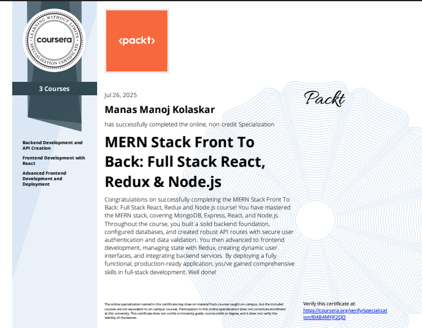

# DevConnector 👨‍💻

A full-stack MERN social network application designed specifically for developers to connect, share experiences, and showcase their skills. Built as part of a Coursera project-based course to master MongoDB, Express.js, React, and Node.js development.


---

## 📖 Table of Contents

- [Overview](#overview)
- [Features](#features)
- [Tech Stack](#tech-stack)
- [Project Structure](#project-structure)
- [Prerequisites](#prerequisites)
- [Installation & Setup](#installation--setup)
- [Environment Configuration](#environment-configuration)
- [API Documentation](#api-documentation)
- [Frontend Architecture](#frontend-architecture)
- [Database Schema](#database-schema)
- [Authentication & Security](#authentication--security)
- [Deployment](#deployment)
- [Contributing](#contributing)
- [License](#license)
- [Acknowledgments](#acknowledgments)

---

<p align="center">
  
</p>


## 🎯 Overview

DevConnector is a comprehensive social networking platform tailored for software developers. The application enables developers to:

- **Create Professional Profiles**: Showcase skills, experience, and education
- **Connect with Peers**: Follow and interact with other developers
- **Share Knowledge**: Post updates, ask questions, and share insights
- **Build Networks**: Like, comment, and engage with the developer community
- **Showcase Projects**: Link GitHub repositories and display portfolio work

This project demonstrates modern full-stack development practices using the MERN stack, featuring JWT-based authentication, RESTful API design, responsive UI, and robust state management.

---

## ✨ Features

### 🔐 Authentication & Authorization
- **Secure Registration/Login**: JWT-based authentication system
- **Protected Routes**: Role-based access control for sensitive operations
- **Session Management**: Automatic token refresh and secure logout
- **Password Security**: Bcrypt encryption for password hashing

### 👤 Profile Management
- **Developer Profiles**: Comprehensive profile creation with professional details
- **Experience & Education**: Timeline of work history and educational background
- **Skills Showcase**: Tag-based skill representation
- **Social Links**: Integration with GitHub, LinkedIn, Twitter, and other platforms
- **Avatar Integration**: Gravatar integration for profile pictures

### 📱 Social Features
- **Post Creation**: Rich text posts with formatting support
- **Interactive Feed**: Real-time feed of developer posts
- **Engagement System**: Like and comment functionality
- **Developer Discovery**: Browse and connect with other developers
- **Activity Tracking**: Monitor interactions and engagement

### 🛠️ Technical Features
- **Responsive Design**: Mobile-first responsive UI
- **Real-time Updates**: Live notifications and feed updates
- **Search Functionality**: Find developers by skills, location, or experience
- **Data Validation**: Comprehensive input validation on both client and server
- **Error Handling**: Graceful error management with user-friendly messages

---

## 🏗️ Tech Stack

### **Backend**
- **Runtime**: Node.js (v16+)
- **Framework**: Express.js
- **Database**: MongoDB with Mongoose ODM
- **Authentication**: JSON Web Tokens (JWT)
- **Validation**: Express Validator
- **Security**: Bcrypt, Helmet, CORS
- **API Testing**: Postman collection included

### **Frontend**
- **Library**: React 18+ with Hooks
- **State Management**: Redux Toolkit
- **Routing**: React Router v6
- **Styling**: CSS3, Bootstrap 5
- **HTTP Client**: Axios
- **UI Components**: Custom React components
- **Form Handling**: Controlled components with validation

### **Development Tools**
- **Build Tool**: Webpack (via Create React App)
- **Package Manager**: npm
- **Code Formatting**: Prettier
- **Development Server**: Concurrently for full-stack development
- **Environment**: dotenv for environment variables

---

## 📁 Project Structure

```
devconnector-coursera/
│
├── 📁 client/                    # React frontend application
│   ├── 📁 public/
│   │   ├── index.html
│   │   └── favicon.ico
│   ├── 📁 src/
│   │   ├── 📁 components/        # Reusable React components
│   │   │   ├── 📁 auth/          # Authentication components
│   │   │   │   ├── Login.js
│   │   │   │   └── Register.js
│   │   │   ├── 📁 dashboard/     # Dashboard components
│   │   │   │   ├── Dashboard.js
│   │   │   │   ├── Education.js
│   │   │   │   └── Experience.js
│   │   │   ├── 📁 layout/        # Layout components
│   │   │   │   ├── Alert.js
│   │   │   │   ├── Landing.js
│   │   │   │   ├── Navbar.js
│   │   │   │   └── Spinner.js
│   │   │   ├── 📁 posts/         # Post-related components
│   │   │   │   ├── Posts.js
│   │   │   │   ├── PostItem.js
│   │   │   │   └── PostForm.js
│   │   │   ├── 📁 profile/       # Profile components
│   │   │   │   ├── Profile.js
│   │   │   │   ├── ProfileTop.js
│   │   │   │   └── ProfileAbout.js
│   │   │   ├── 📁 profile-forms/ # Profile form components
│   │   │   │   ├── CreateProfile.js
│   │   │   │   ├── EditProfile.js
│   │   │   │   ├── AddExperience.js
│   │   │   │   └── AddEducation.js
│   │   │   ├── 📁 profiles/      # Profiles listing
│   │   │   │   ├── Profiles.js
│   │   │   │   └── ProfileItem.js
│   │   │   └── 📁 routing/       # Route components
│   │   │       └── PrivateRoute.js
│   │   ├── 📁 redux/             # Redux state management
│   │   │   ├── 📁 actions/       # Action creators
│   │   │   │   ├── alert.js
│   │   │   │   ├── auth.js
│   │   │   │   ├── post.js
│   │   │   │   └── profile.js
│   │   │   ├── 📁 reducers/      # Redux reducers
│   │   │   │   ├── alert.js
│   │   │   │   ├── auth.js
│   │   │   │   ├── index.js
│   │   │   │   ├── post.js
│   │   │   │   └── profile.js
│   │   │   └── store.js          # Redux store configuration
│   │   ├── 📁 utils/             # Utility functions
│   │   │   ├── api.js
│   │   │   ├── setAuthToken.js
│   │   │   └── formatDate.js
│   │   ├── App.js                # Main App component
│   │   ├── App.css               # Global styles
│   │   └── index.js              # React DOM entry point
│   └── package.json              # Client dependencies
│
├── 📁 server/                    # Express.js backend application
│   ├── 📁 config/                # Configuration files
│   │   ├── db.js                 # Database connection
│   │   └── default.json          # Default configuration
│   ├── 📁 middleware/            # Custom middleware
│   │   └── auth.js               # JWT authentication middleware
│   ├── 📁 models/                # Mongoose data models
│   │   ├── User.js               # User model
│   │   ├── Profile.js            # Profile model
│   │   └── Post.js               # Post model
│   ├── 📁 routes/                # API route handlers
│   │   └── 📁 api/
│   │       ├── auth.js           # Authentication routes
│   │       ├── posts.js          # Posts CRUD routes
│   │       ├── profile.js        # Profile management routes
│   │       └── users.js          # User registration routes
│   ├── server.js                 # Express server entry point
│   └── package.json              # Server dependencies
│
├── 📄 README.md                  # Project documentation
├── 📄 .gitignore                 # Git ignore rules
└── 📄 package.json               # Root package.json for scripts
```

---

## 📋 Prerequisites

Before running this application, ensure you have the following installed:

### **Required Software**
- **Node.js**: Version 16.0 or higher
- **npm**: Version 8.0 or higher (comes with Node.js)
- **MongoDB**: Local installation or MongoDB Atlas account
- **Git**: For version control

### **Development Tools (Recommended)**
- **VS Code**: With React, Node.js, and MongoDB extensions
- **Postman**: For API testing
- **MongoDB Compass**: For database visualization
- **Chrome DevTools**: For debugging React applications

### **API Keys & Services**
- **MongoDB Atlas**: Database connection string
- **GitHub Personal Access Token**: For repository integration
- **Gravatar Account**: For profile avatars (optional)

---

## 🚀 Installation & Setup

### **1. Clone the Repository**
```bash
# Clone the project
git clone https://github.com/manasscodes/devconnector-coursera.git

# Navigate to project directory
cd devconnector-coursera
```

### **2. Server Setup**
```bash
# Navigate to server directory
cd server

# Install server dependencies
npm install

# Install additional security packages
npm install helmet cors express-rate-limit

# Return to root directory
cd ..
```

### **3. Client Setup**
```bash
# Navigate to client directory
cd client

# Install client dependencies
npm install

# Install additional UI packages (if needed)
npm install react-router-dom@6 axios redux @reduxjs/toolkit

# Return to root directory
cd ..
```

### **4. Root Level Setup**
```bash
# Install concurrently for running both server and client
npm install

# Verify installation
npm run dev
```

---

## ⚙️ Environment Configuration

### **Server Configuration**

Create `server/config/default.json`:
```json
{
  "mongoURI": "mongodb://localhost:27017/devconnector",
  "jwtSecret": "your-super-secret-jwt-key-here",
  "githubToken": "your-github-personal-access-token"
}
```

### **Production Configuration**

Create `server/config/production.json`:
```json
{
  "mongoURI": "your-mongodb-atlas-connection-string",
  "jwtSecret": "your-production-jwt-secret",
  "githubToken": "your-github-token"
}
```

### **Environment Variables**

Create `.env` file in the root directory:
```env
NODE_ENV=development
PORT=5000
MONGODB_URI=mongodb://localhost:27017/devconnector
JWT_SECRET=your-jwt-secret-key
GITHUB_TOKEN=your-github-token
CLIENT_URL=http://localhost:3000
```

### **MongoDB Setup**

#### **Local MongoDB**
```bash
# Start MongoDB service
mongod

# Connect to MongoDB shell
mongo

# Create database
use devconnector

# Create a user (optional)
db.createUser({
  user: "devconnector",
  pwd: "password123",
  roles: ["readWrite"]
})
```

#### **MongoDB Atlas (Cloud)**
1. Create account at [MongoDB Atlas](https://www.mongodb.com/atlas)
2. Create a new cluster
3. Set up database user and password
4. Whitelist your IP address
5. Get connection string and add to configuration

---

## 🔗 API Documentation

### **Authentication Endpoints**

#### **POST /api/users** - Register User
```http
POST /api/users
Content-Type: application/json

{
  "name": "John Doe",
  "email": "john@example.com",
  "password": "password123"
}
```

#### **POST /api/auth** - Login User
```http
POST /api/auth
Content-Type: application/json

{
  "email": "john@example.com",
  "password": "password123"
}
```

#### **GET /api/auth** - Get Current User
```http
GET /api/auth
Authorization: Bearer <jwt-token>
```

### **Profile Endpoints**

#### **GET /api/profile/me** - Get Current User Profile
```http
GET /api/profile/me
Authorization: Bearer <jwt-token>
```

#### **POST /api/profile** - Create/Update Profile
```http
POST /api/profile
Authorization: Bearer <jwt-token>
Content-Type: application/json

{
  "company": "Tech Corp",
  "website": "https://techcorp.com",
  "location": "San Francisco, CA",
  "bio": "Passionate full-stack developer",
  "status": "Senior Developer",
  "githubusername": "johndoe",
  "skills": "JavaScript,React,Node.js,MongoDB",
  "social": {
    "linkedin": "https://linkedin.com/in/johndoe",
    "twitter": "https://twitter.com/johndoe"
  }
}
```

#### **PUT /api/profile/experience** - Add Experience
```http
PUT /api/profile/experience
Authorization: Bearer <jwt-token>
Content-Type: application/json

{
  "title": "Senior Developer",
  "company": "Tech Solutions Inc",
  "location": "New York, NY",
  "from": "2020-01-15",
  "to": "2023-03-20",
  "current": false,
  "description": "Led development of scalable web applications"
}
```

### **Posts Endpoints**

#### **GET /api/posts** - Get All Posts
```http
GET /api/posts
Authorization: Bearer <jwt-token>
```

#### **POST /api/posts** - Create Post
```http
POST /api/posts
Authorization: Bearer <jwt-token>
Content-Type: application/json

{
  "text": "Just deployed my first MERN application! 🚀"
}
```

#### **PUT /api/posts/like/:id** - Like/Unlike Post
```http
PUT /api/posts/like/60c72b2f9b1d8b3a4c8e6f7a
Authorization: Bearer <jwt-token>
```

### **Error Responses**

All endpoints return consistent error responses:
```json
{
  "errors": [
    {
      "msg": "Error message description",
      "param": "field_name",
      "location": "body"
    }
  ]
}
```

---

## 🎨 Frontend Architecture

### **Component Hierarchy**

```
App.js
├── Navbar
├── Alert
├── Routes
│   ├── Landing
│   ├── Register
│   ├── Login
│   ├── Dashboard
│   │   ├── DashboardActions
│   │   ├── Experience
│   │   └── Education
│   ├── CreateProfile
│   ├── EditProfile
│   ├── Profiles
│   │   └── ProfileItem
│   ├── Profile
│   │   ├── ProfileTop
│   │   ├── ProfileAbout
│   │   ├── ProfileExperience
│   │   ├── ProfileEducation
│   │   └── ProfileGithub
│   └── Posts
│       ├── PostForm
│       └── PostItem
└── PrivateRoute (HOC)
```

### **Redux State Structure**

```javascript
{
  auth: {
    token: "jwt-token-string",
    isAuthenticated: true,
    loading: false,
    user: {
      id: "user-id",
      name: "User Name",
      email: "user@example.com",
      avatar: "gravatar-url"
    }
  },
  profile: {
    profile: { /* current user profile */ },
    profiles: [ /* all profiles */ ],
    repos: [ /* github repositories */ ],
    loading: false,
    error: {}
  },
  post: {
    posts: [ /* all posts */ ],
    post: { /* single post */ },
    loading: false,
    error: {}
  },
  alert: [
    {
      id: "alert-id",
      msg: "Alert message",
      alertType: "success"
    }
  ]
}
```

### **Custom Hooks**

The application uses several custom hooks for improved code reusability:

```javascript
// useAuth.js - Authentication hook
const useAuth = () => {
  const { token, isAuthenticated, user } = useSelector(state => state.auth);
  return { token, isAuthenticated, user };
};

// useProfile.js - Profile management hook
const useProfile = () => {
  const dispatch = useDispatch();
  const { profile, loading } = useSelector(state => state.profile);
  
  const createProfile = (profileData) => {
    dispatch(createProfileAction(profileData));
  };
  
  return { profile, loading, createProfile };
};
```

---

## 🗄️ Database Schema

### **User Model**
```javascript
{
  _id: ObjectId,
  name: String (required),
  email: String (required, unique),
  password: String (required, hashed),
  avatar: String (gravatar URL),
  date: Date (default: Date.now)
}
```

### **Profile Model**
```javascript
{
  _id: ObjectId,
  user: ObjectId (ref: 'users'),
  company: String,
  website: String,
  location: String,
  status: String (required),
  skills: [String] (required),
  bio: String,
  githubusername: String,
  experience: [
    {
      title: String (required),
      company: String (required),
      location: String,
      from: Date (required),
      to: Date,
      current: Boolean,
      description: String
    }
  ],
  education: [
    {
      school: String (required),
      degree: String (required),
      fieldofstudy: String (required),
      from: Date (required),
      to: Date,
      current: Boolean,
      description: String
    }
  ],
  social: {
    youtube: String,
    twitter: String,
    facebook: String,
    linkedin: String,
    instagram: String
  },
  date: Date (default: Date.now)
}
```

### **Post Model**
```javascript
{
  _id: ObjectId,
  user: ObjectId (ref: 'users'),
  text: String (required),
  name: String,
  avatar: String,
  likes: [
    {
      user: ObjectId (ref: 'users')
    }
  ],
  comments: [
    {
      user: ObjectId (ref: 'users'),
      text: String (required),
      name: String,
      avatar: String,
      date: Date (default: Date.now)
    }
  ],
  date: Date (default: Date.now)
}
```

---

## 🔒 Authentication & Security

### **JWT Authentication Flow**

1. **Registration/Login**: User provides credentials
2. **Token Generation**: Server creates JWT with user payload
3. **Token Storage**: Client stores token in localStorage
4. **Request Headers**: Token sent in Authorization header
5. **Token Verification**: Server validates token on protected routes
6. **Auto-logout**: Token expiration triggers automatic logout

### **Security Measures**

#### **Password Security**
```javascript
// Bcrypt hashing with salt rounds
const saltRounds = 10;
const hashedPassword = await bcrypt.hash(password, saltRounds);
```

#### **Input Validation**
```javascript
// Express Validator middleware
const registerValidation = [
  check('name', 'Name is required').not().isEmpty(),
  check('email', 'Please include a valid email').isEmail(),
  check('password', 'Password must be 6 or more characters').isLength({ min: 6 })
];
```

#### **Security Headers**
```javascript
// Helmet.js security headers
app.use(helmet({
  contentSecurityPolicy: {
    directives: {
      defaultSrc: ["'self'"],
      styleSrc: ["'self'", "'unsafe-inline'"],
      scriptSrc: ["'self'"],
      imgSrc: ["'self'", "data:", "https:"]
    }
  }
}));
```

#### **Rate Limiting**
```javascript
// Rate limiting middleware
const rateLimit = require('express-rate-limit');

const limiter = rateLimit({
  windowMs: 15 * 60 * 1000, // 15 minutes
  max: 100, // limit each IP to 100 requests per windowMs
  message: 'Too many requests from this IP'
});
```

---

## 🚀 Deployment

### **Development Mode**
```bash
# Run both client and server concurrently
npm run dev

# Run server only
npm run server

# Run client only
npm run client
```

### **Production Build**
```bash
# Build client for production
cd client
npm run build

# Set production environment
export NODE_ENV=production

# Start production server
cd ..
npm start
```

### **Heroku Deployment**

#### **Prepare for Deployment**
```bash
# Create production branch (local only)
git checkout -b production

# Add production config
git add -f server/config/production.json
git commit -m "Add production config"

# Create Heroku app
heroku create your-app-name

# Set environment variables
heroku config:set NODE_ENV=production
heroku config:set JWT_SECRET=your-production-jwt-secret
heroku config:set MONGODB_URI=your-mongodb-atlas-uri
```

#### **Deploy to Heroku**
```bash
# Push to Heroku
git push heroku production:main

# View logs
heroku logs --tail

# Open deployed app
heroku open
```

### **Vercel Deployment (Frontend)**

#### **Setup Vercel**
```bash
# Install Vercel CLI
npm i -g vercel

# Login to Vercel
vercel login

# Deploy from client directory
cd client
vercel

# Set environment variables in Vercel dashboard
# REACT_APP_API_URL=your-backend-url
```

### **Docker Deployment**

#### **Dockerfile**
```dockerfile
# Multi-stage build for production
FROM node:16-alpine as build

# Build client
WORKDIR /app/client
COPY client/package*.json ./
RUN npm ci --only=production
COPY client/ ./
RUN npm run build

# Production server
FROM node:16-alpine
WORKDIR /app
COPY server/package*.json ./
RUN npm ci --only=production
COPY server/ ./
COPY --from=build /app/client/build ./public

EXPOSE 5000
CMD ["node", "server.js"]
```

#### **Docker Compose**
```yaml
version: '3.8'
services:
  app:
    build: .
    ports:
      - "5000:5000"
    environment:
      - NODE_ENV=production
      - MONGODB_URI=mongodb://mongo:27017/devconnector
    depends_on:
      - mongo
  
  mongo:
    image: mongo:5.0
    ports:
      - "27017:27017"
    volumes:
      - mongo_data:/data/db

volumes:
  mongo_data:
```

---

## 🤝 Contributing

We welcome contributions to DevConnector! Here's how you can help:

### **Development Workflow**

1. **Fork the Repository**
   ```bash
   git clone https://github.com/manasscodes/devconnector-coursera.git
   cd devconnector-coursera
   ```

2. **Create Feature Branch**
   ```bash
   git checkout -b feature/amazing-feature
   ```

3. **Make Changes**
   - Follow existing code style
   - Add tests for new features
   - Update documentation

4. **Commit Changes**
   ```bash
   git commit -m "Add amazing feature"
   ```

5. **Push and Create PR**
   ```bash
   git push origin feature/amazing-feature
   ```

### **Code Style Guidelines**

#### **JavaScript/React**
- Use ES6+ features
- Follow functional component patterns
- Use React Hooks over class components
- Implement proper error boundaries

#### **File Organization**
- Components in `client/src/components/`
- Redux actions in `client/src/redux/actions/`
- API routes in `server/routes/api/`
- Models in `server/models/`

#### **Naming Conventions**
- Components: PascalCase (`UserProfile.js`)
- Files: camelCase (`userService.js`)
- Constants: UPPER_SNAKE_CASE (`API_BASE_URL`)
- CSS classes: kebab-case (`user-profile`)

### **Testing Guidelines**

```bash
# Run tests
npm test

# Run tests with coverage
npm run test:coverage

# Run integration tests
npm run test:integration
```

---

## 📄 License

This project is licensed under the MIT License - see the [LICENSE](LICENSE) file for details.

```
MIT License

Copyright (c) 2024 Manas Kolaskar

Permission is hereby granted, free of charge, to any person obtaining a copy
of this software and associated documentation files (the "Software"), to deal
in the Software without restriction, including without limitation the rights
to use, copy, modify, merge, publish, distribute, sublicense, and/or sell
copies of the Software, and to permit persons to whom the Software is
furnished to do so, subject to the following conditions:

The above copyright notice and this permission notice shall be included in all
copies or substantial portions of the Software.

THE SOFTWARE IS PROVIDED "AS IS", WITHOUT WARRANTY OF ANY KIND, EXPRESS OR
IMPLIED, INCLUDING BUT NOT LIMITED TO THE WARRANTIES OF MERCHANTABILITY,
FITNESS FOR A PARTICULAR PURPOSE AND NONINFRINGEMENT. IN NO EVENT SHALL THE
AUTHORS OR COPYRIGHT HOLDERS BE LIABLE FOR ANY CLAIM, DAMAGES OR OTHER
LIABILITY, WHETHER IN AN ACTION OF CONTRACT, TORT OR OTHERWISE, ARISING FROM,
OUT OF OR IN CONNECTION WITH THE SOFTWARE OR THE USE OR OTHER DEALINGS IN THE
SOFTWARE.
```

---

## 🙏 Acknowledgments

### **Course & Learning**
- **Coursera**: Platform for project-based learning
- **MERN Stack Community**: For extensive documentation and support
- **Brad Traversy**: Original DevConnector concept and methodology

### **Technologies**
- **MongoDB**: For flexible document database
- **Express.js**: For robust web application framework
- **React**: For building user interfaces
- **Node.js**: For server-side JavaScript runtime

### **Contributors**
- **Manas Kolaskar** - *Initial work* - [@manasscodes](https://github.com/manasscodes)

### **Special Thanks**
- Open source community for amazing packages and tools
- Stack Overflow community for problem-solving assistance
- GitHub for hosting and version control
- All beta testers and early users

---

## 📞 Support & Contact

### **Developer**
**Manas Kolaskar**
- 🛠 Full-Stack Developer | MERN | GenAI Projects
- 🔗 GitHub: [@manasscodes](https://github.com/manasscodes)
- 📫 LinkedIn: [Manas Kolaskar](https://www.linkedin.com/in/manaskolaskar)
- 📧 Email: [Contact via LinkedIn](https://www.linkedin.com/in/manaskolaskar)

### **Project Links**
- 🔗 **Repository**: [DevConnector Coursera](https://github.com/manasscodes/devconnector-coursera)
- 📋 **Issues**: [Report Issues](https://github.com/manasscodes/devconnector-coursera/issues)
- 💡 **Discussions**: [Join Discussions](https://github.com/manasscodes/devconnector-coursera/discussions)

### **Getting Help**
If you encounter any issues or have questions:

1. Check the [Issues](https://github.com/manasscodes/devconnector-coursera/issues) page
2. Search existing discussions
3. Create a new issue with detailed description
4. Join our community discussions

---

## 📈 Project Status

- ✅ **Backend API**: Complete with authentication, profiles, and posts
- ✅ **Frontend React App**: Responsive UI with Redux state management
- ✅ **Database Integration**: MongoDB with Mongoose ODM
- 🔄 **Deployment**: In progress - preparing for production deployment
- 📋 **Documentation**: Comprehensive README and API documentation
- 🧪 **Testing**: Unit and integration tests implementation planned

---

⭐️ **Star this repository if you find it helpful!**

*This project is built for educational purposes as part of a Coursera course and is open to improvements and contributions from the developer community.*